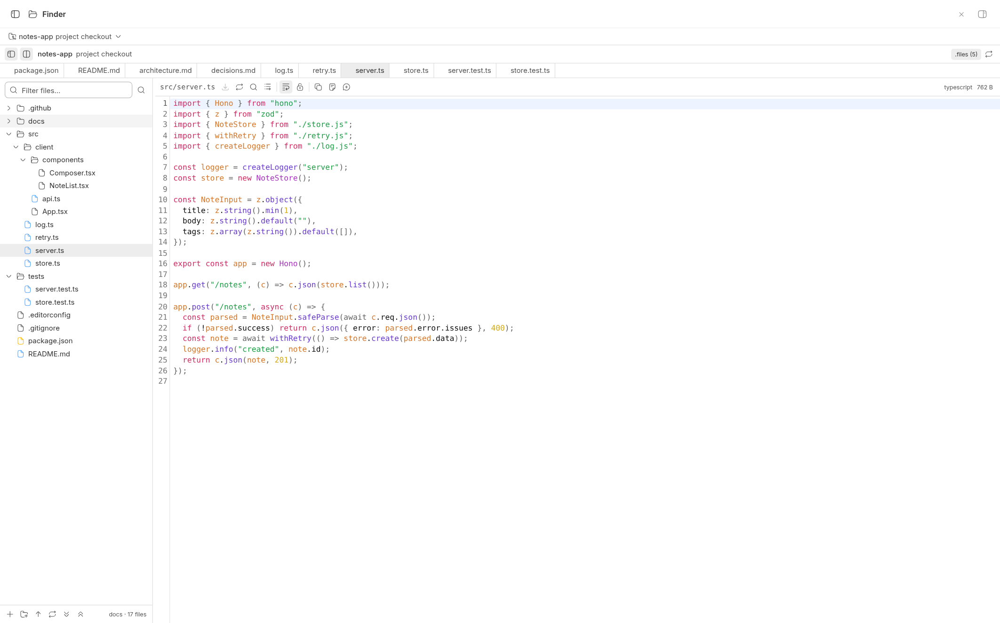
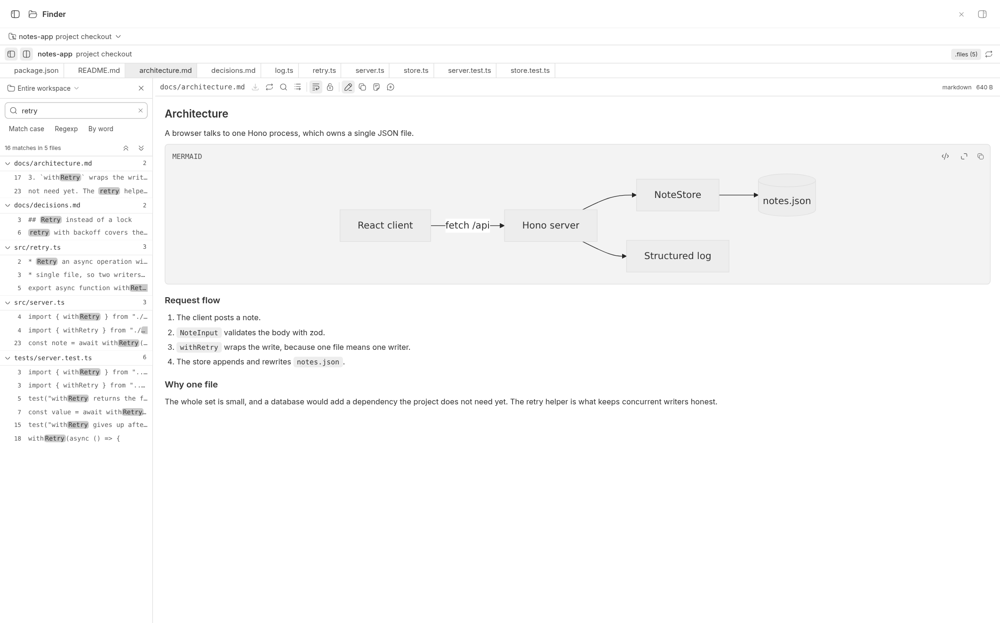
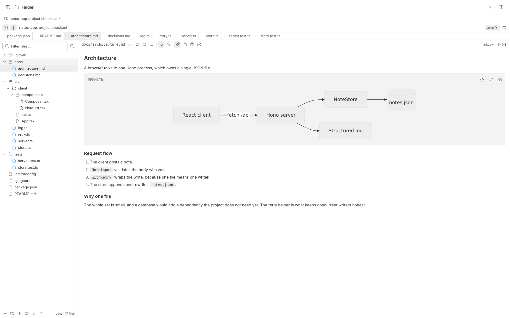
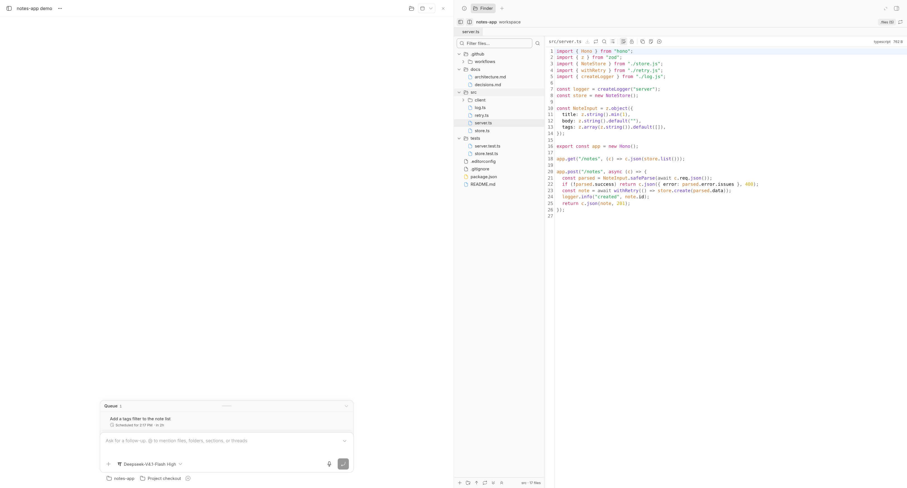
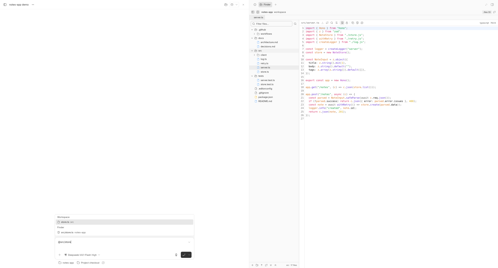

# bb-plugin-finder

A VS Code-style file browser for BB. It browses the workspace behind a project,
an environment, or a thread: a file tree, a CodeMirror editor with find,
go-to-line, line wrap, and auto-save, a markdown preview that renders Mermaid
diagrams, and an "add this file to the prompt" action that attaches the file as
agent-visible context.

## Preview

The screenshots below come from a throwaway project, `notes-app`: a small Hono
service with a React client, picked because it has folders, a `.github`
directory, a Mermaid diagram, and a mention-worthy file name.



Search in files reads every file under the chosen scope. Hits group under a
sticky file header and a click opens the file at its line:



Markdown opens as a preview, and a fenced `mermaid` block renders through BB's
own message renderer:



The same explorer sits beside a thread, pinned to that thread's workspace:



`@` in any composer lists workspace files; the pill carries the path, and the
contents are read when the message is sent:



## What it looks like

- A **Finder** page in the sidebar (`app.slots.navPanel`), routed at
  `/plugins/finder/files/<scopeKind>/<scopeId>/<path>` so a workspace and
  the file open in it are both linkable and survive back/forward.
- A **Finder** tab beside any thread (`app.slots.threadPanelAction`),
  pinned to that thread's own workspace — the files the agent is editing — plus
  a folder button in the thread header's action row
  (`app.slots.experimental_threadHeaderAction`) that toggles that panel: first
  click opens it, second click closes the panel. The close uses the host's own
  hide control, so the whole panel goes away — including any other tabs open in
  it — and reopening later brings all of them back. Any other state — no tab
  yet, the panel hidden with Ctrl+J, or another panel tab in front — opens: the
  host focuses the tab that is already there instead of duplicating it. The left
  sidebar is never touched.
- An `@`-mention provider, so any composer can reference a workspace file by
  path and have its contents resolved fresh at send time.

## Features

| Feature | Where |
| --- | --- |
| List every file of a chosen project, environment, or thread workspace | Tree pane; the workspace picker in the page header |
| Filter the tree by path | Tree header — narrows the tree to matching paths. Matching folders open by default and still fold individually, and expand/collapse all work while a filter is active; changing the query opens the matches again |
| Auto-save on edit | Toolbar toggle (persisted); writes 1.2 s after typing stops. A conflict or a failed write stops the timer and waits for the user's Reload / Save again / Retry |
| Line wrap on/off | Toolbar toggle (persisted) |
| Find in file | Toolbar button or Mod-F — CodeMirror's panel, with match case, regex, whole word, and replace |
| Go to line | Toolbar button |
| Markdown preview with Mermaid | Default view for `.md`/`.markdown` files; the toolbar toggle switches to the source and back |
| Copy file contents | Toolbar button |
| Copy file path | Toolbar button and tree context menu |
| Open a code reference from chat in Finder's editor | Any file reference BB opens (a chat link such as `SingleWAValidationEngine.java:61`, the environment diff panel) renders in this plugin's editor instead of BB's read-only preview — with line targeting, find, edit, and save. Settings → Files controls it per extension: *Automatic* picks this opener, *Built-in preview* switches back. Markdown stays with BB's preview |
| New file / new folder | Tree footer and context menu |
| Upload files | Tree footer and context menu |
| Search inside files | Tree header — reads file contents under the whole workspace or one folder (chosen from a scope menu), with match case, regexp, and whole word; results group under a sticky file header, the list scrolls, and a hit opens the file at its line. Each file folds away individually, with collapse-all and expand-all in the summary row; folds are keyed by path, so refining the query keeps the same files folded |
| Refresh folder | Tree footer and page header |
| Collapse / expand all | Tree footer |
| Toggle the file editor | Page header |
| Toggle the file tree | Page header |
| Select a file as prompt context | Toolbar button, or `@` in any composer |
| Markdown opens as a preview | Any `.md`/`.markdown` file, the first time it is opened |

## Reopening the panel

The host unmounts a panel tab whenever it stops being the front tab, so the
Finder remembers what it was showing, per workspace, in `localStorage`:

- the folders left expanded, the file in front, every open tab, and the
  directory that New file, New folder, and Upload target;
- text typed but not yet saved. A draft outlives a panel close, a tab switch,
  and a page reload, and is discarded by Save, Reload from disk, or closing the
  tab. Saving the file writes the text and retires the draft in one step.

Contents are deliberately *not* remembered — only paths. A file may well have
changed while the panel was shut, so restored tabs re-read from disk. A path
that no longer exists shows its error on the tab rather than silently vanishing.

State is keyed by workspace identity (`thread:<id>`, `environment:<id>`,
`project:<id>`), so a thread's worktree and the project checkout it came from
keep separate histories.

## Layout

- `server.ts` — the backend: scope resolution (thread → environment → project),
  the workspace listing, file read/write with compare-and-swap, create, rename,
  delete, upload, the mention provider, and a `bb finder` CLI.
- `app.tsx` — the frontend entry: the nav panel, the thread panel action, and
  the `fileOpener` registration that routes BB's file opens to `FileOpenerTab`.
- `components/` — `Workspace` (the shell and layout), `Explorer` (the tree and
  its context menu), `CodeEditor` (CodeMirror), `FileView` (toolbar and panes),
  `FileOpenerTab` (the same editor as a BB file tab, for file references opened
  from chat and elsewhere), `FilePaneChrome` (the toolbar/notice/empty-pane
  pieces both panes share), `WorkspacePicker`, and the state hooks.
- `lib/` — path arithmetic, tree building/filtering/fuzzy ranking, content-search
  matching, language detection, the BB-code-theme → CodeMirror theme bridge,
  route parsing, the editor preferences (`lib/prefs.ts`) shared between the
  panel and BB's file tab, and the per-workspace memory of what the panel was
  showing.
- `skills/finder/SKILL.md` — how an agent should use `bb finder`.

## How it reads and writes

The plugin resolves a workspace to a directory and a host, then goes through
`bb.sdk.files`, which is the SDK's host-aware, root-confined, compare-and-swap
file API. Consequences worth knowing:

- A workspace on another machine works; the plugin never touches the local disk
  for a remote root. A **local** root is walked with `node:fs` instead, because
  BB's own recursive listing filters out dependency directories and the plugin
  wants its own configurable exclusion list.
- Every write carries the `sha256` the edit was based on. If an agent changed
  the file underneath you, the save stops with a conflict notice and offers
  Reload or Save again, rather than clobbering the agent's work.
- Paths are confined to the workspace root: a `..` segment or an absolute path
  is refused before it reaches the host.
- The tree refreshes over the plugin's own realtime signal, so a write from
  another tab, another client, or the CLI updates every open tree. A signal
  names the workspace it came from, so a change in one workspace never re-lists
  another.
- The `@`-mention menu reuses one workspace listing for a short window rather
  than re-walking the tree on every keystroke; a write drops that cache.

## Settings

| Setting | Default | Effect |
| --- | --- | --- |
| `excludedDirectories` | `node_modules`, `.git`, `vendor`, `target`, `.venv` | Directory names (one per line) the listing skips at any depth. A name with a `/` is ignored — only basenames are matched. |

Set it with `bb plugin config finder set excludedDirectories $'node_modules\n.git'`.

## CLI

| Command | Effect |
| --- | --- |
| `bb finder root` | Print the resolved workspace root and its machine. |
| `bb finder tree [--all] [--limit <n>]` | List the workspace tree. `--all` includes dotfiles. |
| `bb finder read <path>` | Print a workspace-relative file, truncated at 512 KB. |

## Known limits

- A remote workspace's listing cannot include dotfiles: BB's `files.listPaths`
  drops them on the daemon side, so the `.files` toggle only has an effect for a
  workspace on the machine running BB.
- The listing is capped at 40,000 entries locally and 10,000 remotely; the page
  says so when it truncates.
- Text over 4 MB opens read-only, and inline image previews stop at 2 MB.
- Markdown preview is refused past 1,000,000 characters, because the host
  renderer parses the whole document synchronously. Such a file opens in the
  source view instead, and the toolbar's mode button takes it to the editor.
- Content search reads at most 2,000 files, returns at most 500 matches, and
  skips files over 2 MB. It says "partial, refine the search" when it stops
  early. Binary extensions are never decoded; `.docx`/`.xlsx`/`.pptx` are
  skipped too, because decoding one as text would report matches inside a file
  Finder cannot actually read.
- `bb finder read` prints at most 512 KB and says so; BB rejects a plugin
  command whose output passes 1 MiB.

## Development

```sh
npm install
npm run typecheck
npm run build
bb plugin install .
bb plugin dev        # rebuild + reload on save
```
